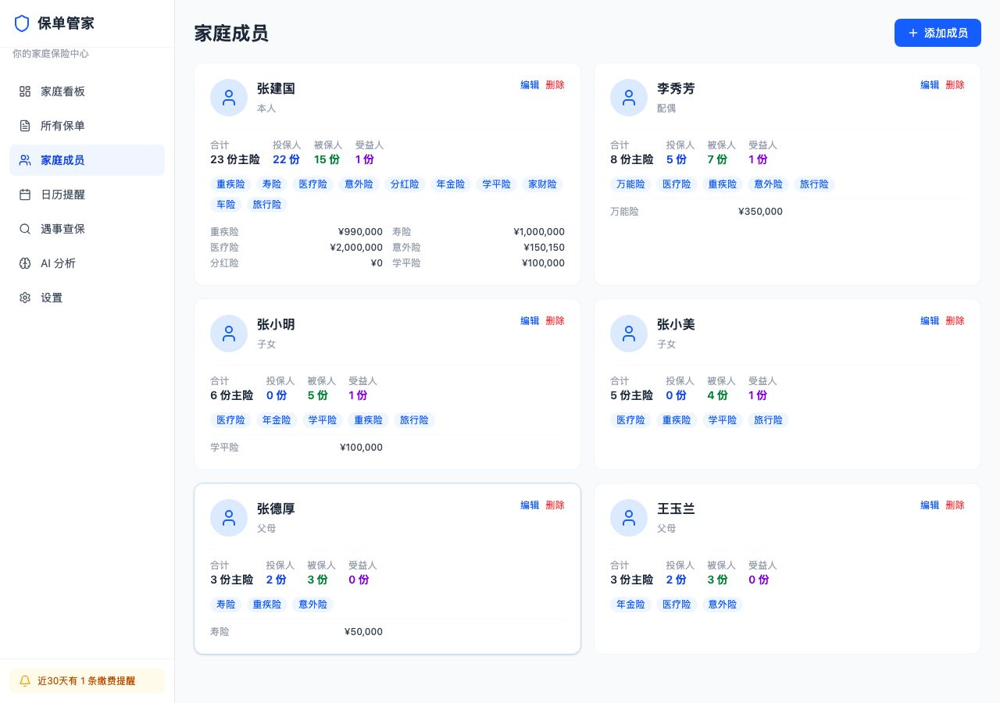
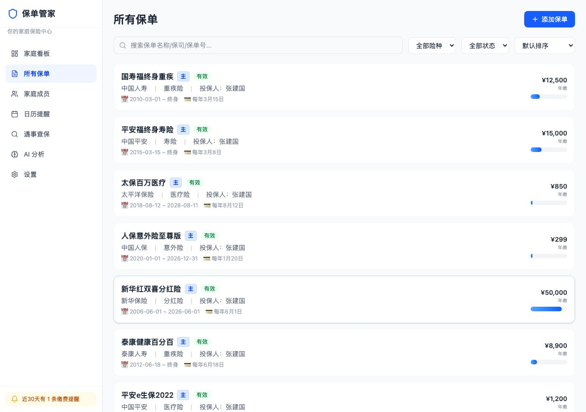
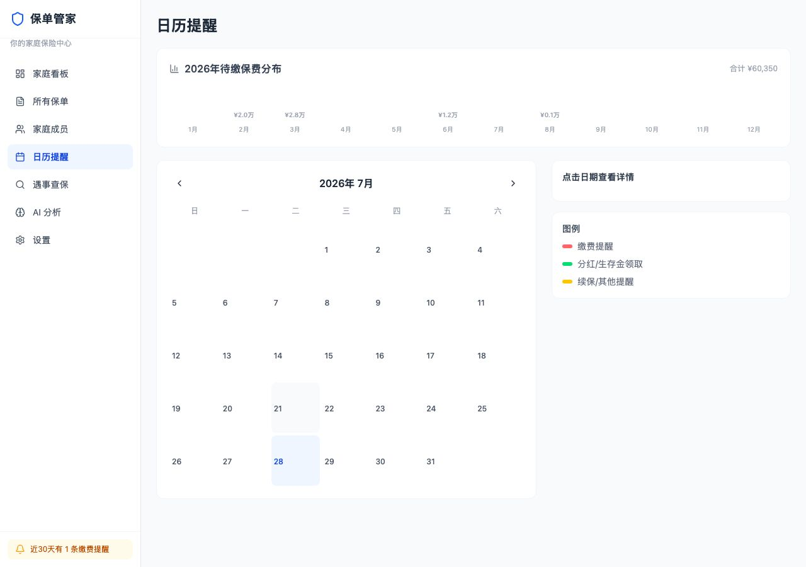
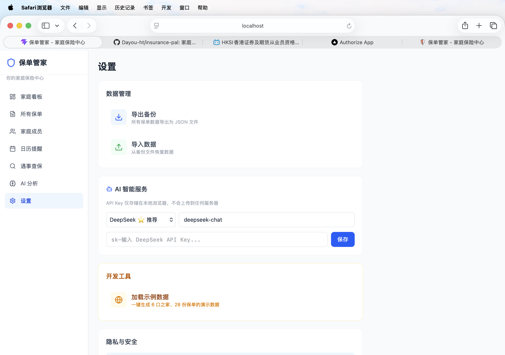

# 🛡️ 保单管家 — 家庭保险中心

> **你的保单数据，只属于你。** 保单管家是完全运行在浏览器中的家庭保单管理工具——所有信息存储在本地 IndexedDB，不上传任何服务器。

## 📸 界面预览

| 家庭成员 | 保单列表 | 日历提醒 | 设置 |
|:---:|:---:|:---:|:---:|
|  |  |  |  |

---

## ✨ 功能一览

| 功能 | 说明 |
|---|---|
| 📋 **保单管理** | 录入、编辑、分类管理全家保单，支持主险 + 附加险结构 |
| 👨‍👩‍👧‍👦 **家庭成员** | 按投保人 / 被保人 / 受益人维度关联保单 |
| 📅 **缴费日历** | 根据保单自动生成缴费计划，到期一目了然 |
| 🤖 **AI 保单解析** | 上传 PDF 或拍照，AI 自动提取保险公司、保费、保障项目等关键信息（需自备 API Key） |
| 📊 **保障分析** | AI 评估保障缺口、重叠和优化建议 |
| 💬 **AI 问答** | 对具体保单条款提问，AI 结合你录入的数据回答 |
| 📈 **保险资产时间轴** | 看清未来几十年保费支出 vs 分红 / 生存金流入的年度现金流 |
| 🔍 **遇事查保** | 输入"住院""骨折""身故"等关键词，自动匹配相关保单 |
| 📱 **PWA 可安装** | 支持添加到手机主屏幕，离线可用 |
| 💾 **数据导出/导入** | 备份全部保单数据为 JSON 文件，跨设备迁移 |

---

## 🔒 隐私声明（我们很认真）

```
┌──────────────────────────────────────┐
│  你的数据只存于你的设备              │
│  ❌ 无后端服务器                      │
│  ❌ 无用户注册 / 无账号               │
│  ❌ 不上传任何保单数据                 │
│  ✅ 100% 浏览器本地存储 (IndexedDB)   │
│  ✅ AI API Key 仅存你浏览器 localStorage │
│  ✅ 开源可审计                        │
└──────────────────────────────────────┘
```

- 所有保单数据存储在浏览器的 **IndexedDB** 中，页面关闭后持续保留
- **AI 功能**：调用你自行配置的 LLM API（DeepSeek / 豆包 / Kimi / 智谱等），API Key 仅存在你浏览器的 `localStorage` 中
- **OCR 识别**：使用 Tesseract.js 在**浏览器端本地**识别图片文字，不上传图片；或通过你配置的 AI 视觉模型识别
- 建议定期通过「设置 → 导出备份」备份你的保单数据

---

## 🚀 快速开始

### 本地运行

```bash
# 克隆
git clone https://github.com/你的用户名/insurance-pal.git
cd insurance-pal

# 安装依赖
npm install

# 启动开发服务器
npm run dev
```

浏览器访问 `http://localhost:5173` 即可使用。

### 构建生产版本

```bash
npm run build
npm run preview
```

### 一键部署

支持部署到 Vercel、Netlify、GitHub Pages 等静态托管平台。

🌐 **在线 Demo**：[insurance-pal-lilac.vercel.app](https://insurance-pal-lilac.vercel.app)

[](https://vercel.com/new)

---

## 🧰 技术栈

| 层 | 技术 |
|---|---|
| 框架 | React 19 + TypeScript |
| 构建 | Vite 8 |
| 样式 | Tailwind CSS 4 |
| 数据 | Dexie.js (IndexedDB 封装) |
| 路由 | React Router v7 |
| 图表 | Recharts |
| OCR | Tesseract.js + pdf.js |
| AI | 直接调用 DeepSeek / 豆包 / Kimi / 智谱等 LLM API |

---

## 🎯 适用场景

- **保险购买者**：管理自己的家庭保单，随时查看保障覆盖和缴费计划
- **保险代理人 / 经纪人**：帮客户做保单整理和诊断，所有数据在本地，合规更放心

---

## 🤝 贡献

欢迎提交 Issue 和 PR。

---

## 📄 License

[MIT](./LICENSE)
